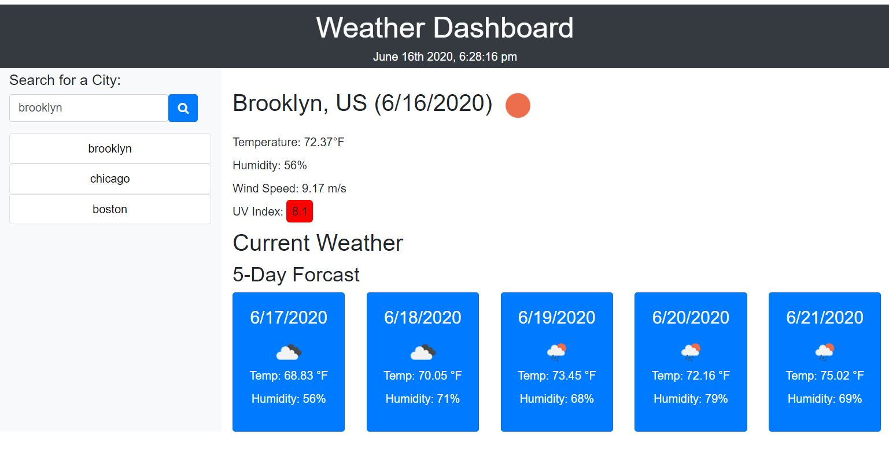

# 06 Server-Side APIs: Weather Dashboard

This app is a weather dashboard that allows the user to input a city and display the current weather conditions, temperature, humidity, wind speed, UV index and 5 day forecast. The user's search history is saved as a button and allows them to quickly check the weather of that city by clicking it.

We use the [OpenWeather API](https://openweathermap.org/api) to retrieve weather data for cities. 

https://mikewclee.github.io/Weather-Dashboard/

## Design

I use 2 weather API as one had city and weather info but need another to get UV and 5 day weather forcast by passing the city's latitude and longitude. 
I changed API parameters to get Fahrenheit and logic to display UV severity with color indicating favorable(green), moderate(orange), or severe (red).
The searched cities are stored in localStorage allowing user quick access.  Duplicate cities are not populated.

Technologies used: HTML5, CSS3, JavaScript, jQuery, Moment.js. OpenWeather API

https://mikewclee.github.io/Weather-Dashboard/

